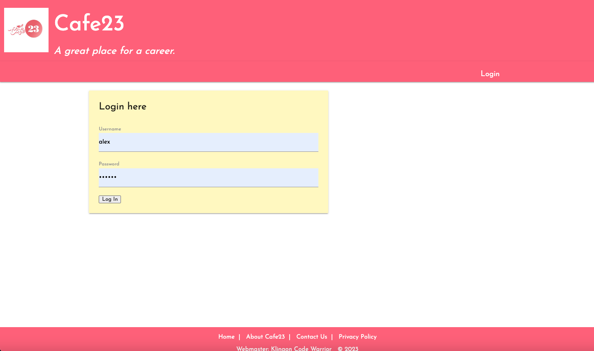
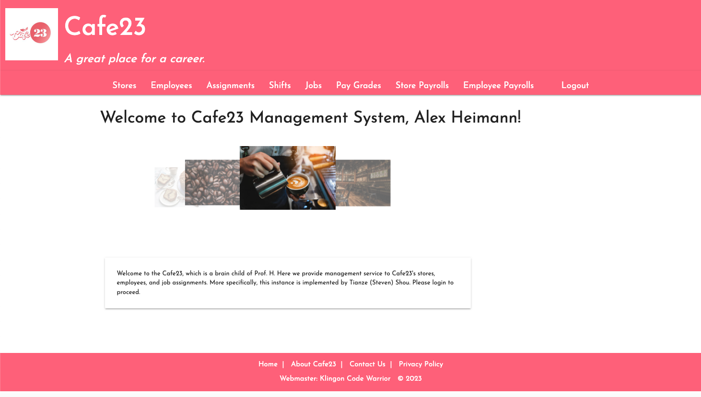
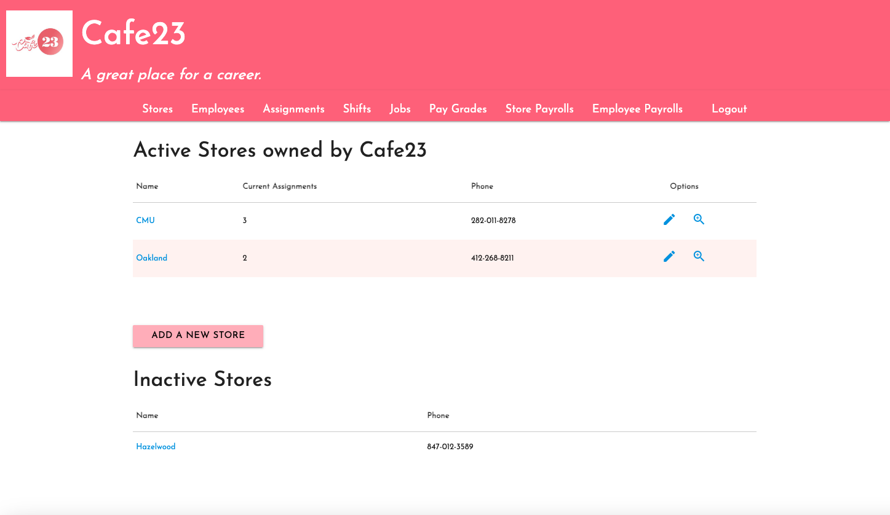
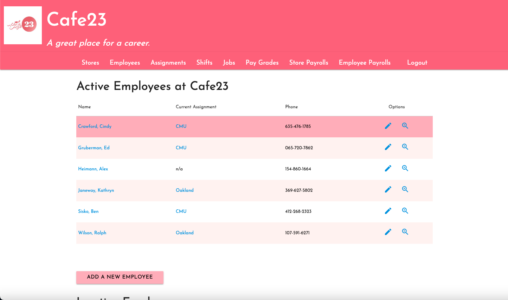
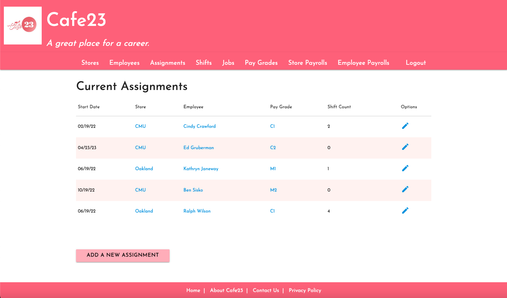
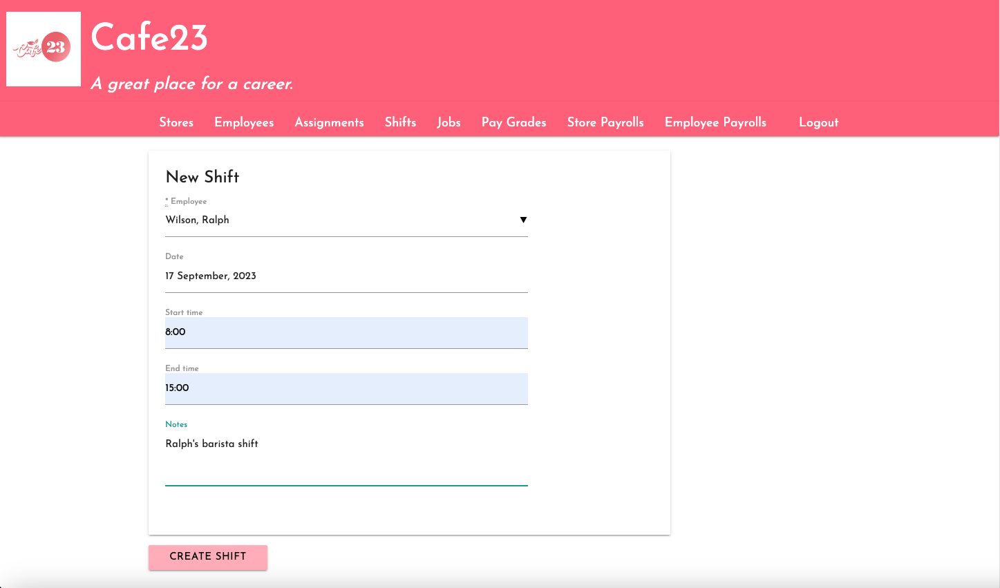
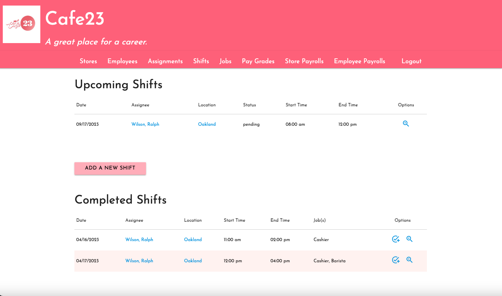
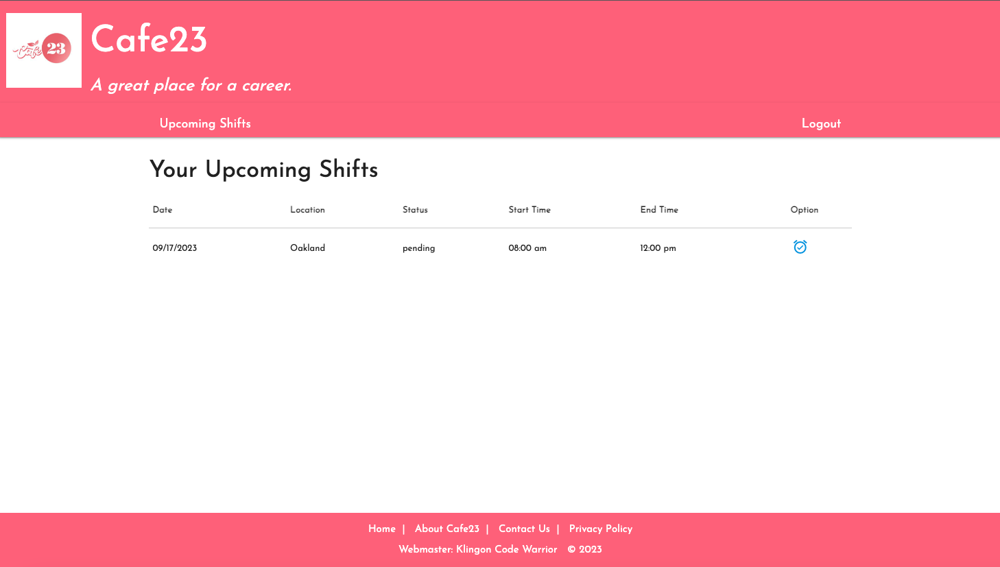
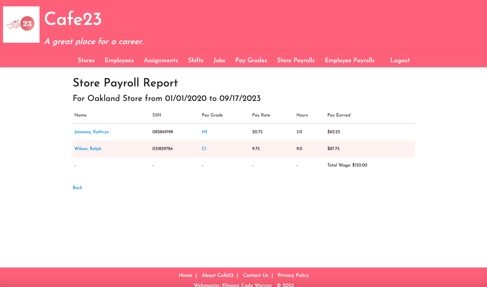

# Cafe23 

## Set up 

We develop Cafe23 on Ruby 3.1.2. Please use the following steps to build and start the project: 

```bash
bundle install 
rails s
```

You will then be able to visit your local server instance from http://127.0.0.1:3000. The development login account 
user name is `alex` with password as `secret`. 

## Main Features 

### Home and login page 

<p align="center"></p> 
<p align="center"></p>

### Store location management 

You can manage the franchise's store locations by listing all information and editing them: 

<p align="center"></p> 

### Employee and position assignment management 

You can add/manage employer information and assignment/promote them to different roles with various pay grades: 

<p align="center"></p> 
<p align="center"></p>

### Shift management 

System admins and store manager accounts are able to assign shift to regular employees: 

<p align="center"></p> 
<p align="center"></p> 

### Employee clocking-in 

Regular employees will be able to clock-in to their shifts to records their working hours in the system for payroll 
purposes: 

<p align="center"></p> 

### Payroll generation 

System admin and store managers can generate payrolls for the stores and the employees they manage: 

<p align="center"></p> 


